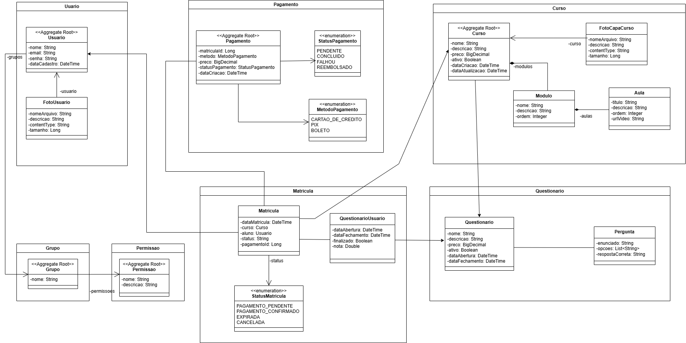

# Plataforma EAD Automativa

Uma plataforma completa de ensino a distância focada em automação. Ideal para mentores e professores que desejam escalar seus conteúdos, permitindo que o aluno siga seu próprio ritmo, desde a matrícula até a emissão automática do certificado.

# Tecnologias e Integrações

- Linguagem & Framework: Java 17 com Spring Boot.

- Segurança: Spring Security para autenticação e autorização.

- Banco de Dados: MySQL com persistência via Spring Data JPA.

- Armazenamento de Arquivos: Amazon S3 (Produção) e Local Storage (Testes).

- Gerenciamento de Vídeos: Cloudinary.

- Pagamentos: Integração com a API do Asaas.

- Comunicação: Serviço SMTP para envio de e-mails automáticos (Confirmação de pagamento, inscrição e envio de certificado).

- Documentação: Swagger (OpenAPI).

- Testes: Testes de integração para garantir a qualidade do código.

## Modelagem do Sistema

Abaixo está o diagrama de classes que representa a estrutura do domínio da aplicação:



## Funcionalidades

Para o Aluno:
- Matrícula: Automação de matrícula após confirmação de pagamento.

- Conteúdo: Assistir aulas em vídeo hospedadas de forma otimizada.

- Avaliação: Questionários com tempo cronometrado para testar conhecimentos.

- Certificação: Emissão automática de certificado em PDF caso a média da instituição seja atingida.

Para Professores/ADMs:
- Gestão de Conteúdo: Upload de vídeos e criação de novas aulas.

- Gestão de Provas: Criação e edição de questões de forma dinâmica.

# Como executar o projeto

## Back end
Pré-requisitos:
- JDK 17
- Maven 3.x
- Docker & MySQL

### Configuração e Execução

1. **Banco de Dados:** No arquivo `application.properties`, ajuste a URL para o seu banco local. Os dados de teste serão injetados automaticamente via `afterMigrate.sql`.
2. **Armazenamento:** Para testar localmente, mude o caminho no `application.properties` para uma pasta no seu computador.
3. **Teste de Acesso:** O **Usuário de ID 1** já possui status de "pagamento confirmado". Utilize-o para testar os endpoints restritos sem precisar configurar o token do Asaas.

```bash
# clonar repositório
git clone https://github.com/JuniorLicassali/plataforma-ead

# executar o Maven para baixar as dependências e construir o projeto
./mvn clean install

# executar o projeto
./mvnw spring-boot:run
```
