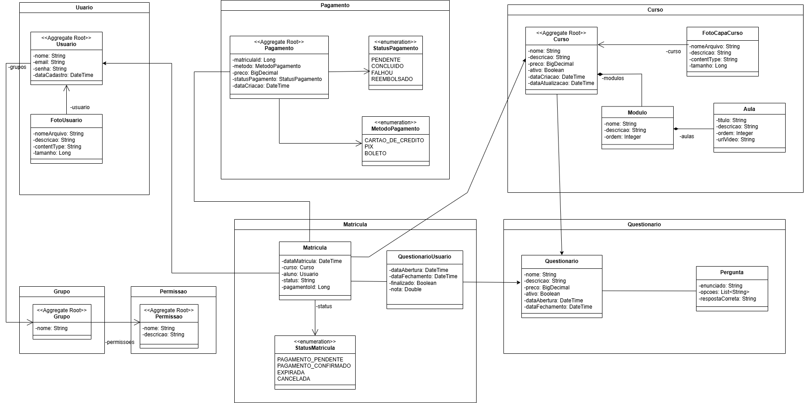

# Plataforma EAD

Uma plataforma completa de ensino a distância focada em automação. Ideal para mentores e professores que desejam escalar seus conteúdos, permitindo que o aluno siga seu próprio ritmo, desde a matrícula até a emissão automática do certificado.

> **💻 Front-end Disponível:** Este projeto possui uma interface completa e responsiva desenvolvida em **Angular 21**. 
> 
> 👉 **https://github.com/JuniorLicassali/plataforma-ead-ui**

---

# 🛠️ Tecnologias e Integrações

- Linguagem & Framework: Java 17 com Spring Boot.

- Segurança: Spring Security para autenticação e autorização.

- Banco de Dados: MySQL com persistência via Spring Data JPA.

- Cache & Performance: Redis (utilizado para armazenamento temporário de códigos de segurança com TTL).

- Armazenamento de Arquivos: Amazon S3 (Produção) e Local Storage (Testes).

- Gerenciamento de Vídeos: Cloudinary.

- Pagamentos: Integração com a API do Asaas.

- Comunicação: Serviço SMTP para envio de e-mails automáticos (Confirmação de pagamento, inscrição, envio de certificado e redefinição de senha).

- Documentação: Swagger (OpenAPI).

- Testes: Testes de integração para garantir a qualidade do código.

## 📐 Arquitetura e Modelagem

A modelagem do sistema foi desenvolvida utilizando conceitos de **DDD (Domain-Driven Design)**, focando em:
- **Aggregates:** Entidades organizadas de forma consistente.
- **Repositories:** Abstração da persistência de dados.
- **Domain Events:** Utilizados para disparar ações desacopladas, como o envio de e-mails automáticos após eventos de domínio (ex: conclusão de curso ou confirmação de pagamento).

### Diagrama de Classes



## 📋 Funcionalidades

Para o Aluno:
- Matrícula: Automação de matrícula após confirmação de pagamento.

- Conteúdo: Assistir aulas em vídeo hospedadas de forma otimizada.

- Avaliação: Questionários com tempo cronometrado para testar conhecimentos.

- Certificação: Emissão automática de certificado em PDF caso a média da instituição seja atingida.

- Recuperação de Senha: Fluxo seguro com geração de código numérico aleatório, envio via e-mail e validação temporal via Redis (expiração de 5 minutos).

Para Professores/ADMs:
- Gestão de Conteúdo: Upload de vídeos e criação de novas aulas.

- Gestão de Provas: Criação e edição de questões de forma dinâmica.

## 📑 Documentação Interativa (Swagger)

Para entender a estrutura das requisições, os campos obrigatórios e os esquemas de cada entidade, acesse a documentação interativa:

👉 [http://localhost:8080/swagger-ui/index.html](http://localhost:8080/swagger-ui/index.html)

> **Dica:** Utilize o Swagger para visualizar os modelos de dados (schemas) e validar o que deve ser enviado no corpo (`body`) das requisições POST e PUT.

## 🔐 Fluxo de Autenticação (OAuth2)

A aplicação é protegida. Para acessar os endpoints, siga os passos abaixo para gerar um **Access Token**:

### 1. Obter o Authorization Code
Acesse a URL abaixo no seu navegador:
> `http://localhost:8080/oauth2/authorize?response_type=code&client_id=plataformaweb&state=abc&redirect_uri=http://127.0.0.1:8080/authorized&scope=READ%20WRITE&code_challenge=bKE9UspwyIPg8LsQHkJaiehiTeUdstI5JZOvaoQRgJA&code_challenge_method=S256`

- **Login:** Use um usuário da massa de dados (Ex: `joao.ger@hotmail.com.br` / senha: `123`).
- **Autorização:** Aceite os escopos de leitura e escrita.
- **Resultado:** Você será redirecionado. Copie o valor do parâmetro `code` que aparecerá na URL.
- **Atenção:** O parâmetro `state` deve ser o mesmo (neste caso, `abc`).

### 2. Trocar o Code pelo Access Token
Faça uma requisição **POST** para `http://localhost:8080/oauth2/token`:
- **Auth:** Basic Auth (Client ID: `plataformaweb` / Secret: `123`).
- **Body (x-www-form-urlencoded):**
    - `grant_type`: `authorization_code`
    - `code`: (O código que você copiou no passo anterior)
    - `redirect_uri`: `http://127.0.0.1:8080/authorized`
    - `code_verifier`: `abc123`

### 3. Validade dos Tokens
- **Access Token:** 15 minutos (deve ser enviado no Header `Authorization: Bearer {token}`).
- **Refresh Token:** 24 horas (utilizado para renovar o acesso sem novo login).

# ⚙️ Como executar o projeto

## Back end
Pré-requisitos:
- JDK 17
- Maven 3.x
- MySQL & Redis

### Configuração e Execução

1. **Banco de Dados:** No arquivo `application.properties`, ajuste a URL para o seu banco local. Os dados de teste serão injetados automaticamente via `afterMigrate.sql`.
2. **Cache:** Se o Redis estiver instalado diretamente na máquina, basta iniciar o serviço. Caso use Docker, você pode subir o Redis rapidamente:
   ```bash
   docker run --name plataforma-redis -p 6379:6379 -d redis bash
3. **Armazenamento:** Para testar localmente, mude o caminho no `application.properties` para uma pasta no seu computador.
4. **Teste de Acesso:** O **Usuário de ID 1** já possui status de "pagamento confirmado". Utilize-o para testar os endpoints restritos sem precisar configurar o token do Asaas.

```bash
# clonar repositório
git clone https://github.com/JuniorLicassali/plataforma-ead

# executar o Maven para baixar as dependências e construir o projeto
./mvn clean install

# executar o projeto
./mvnw spring-boot:run
```
# Autor

Emanoel F. Licassali

https://www.linkedin.com/in/emanoel-licassali-793604228
